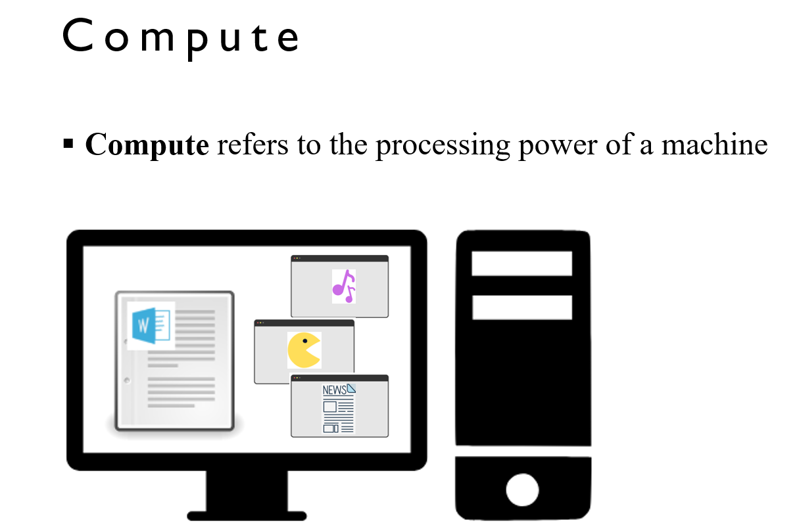
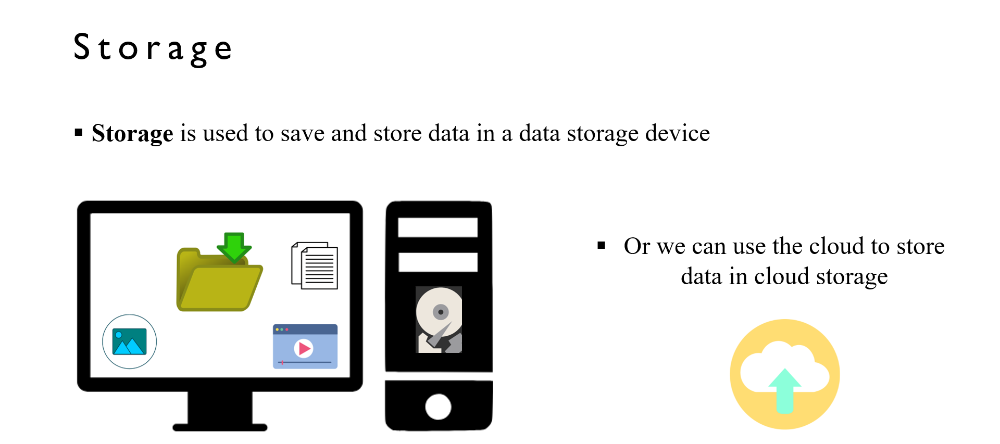
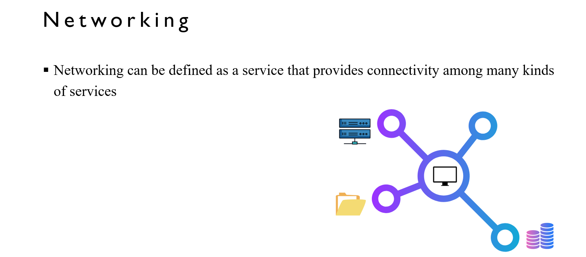
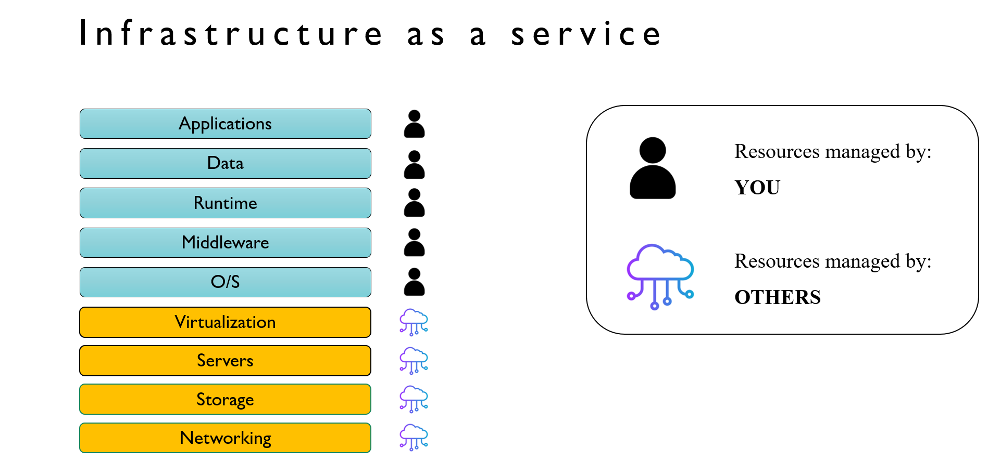
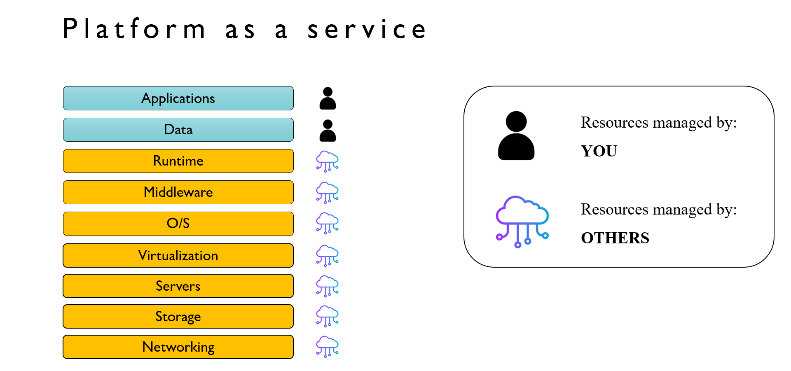
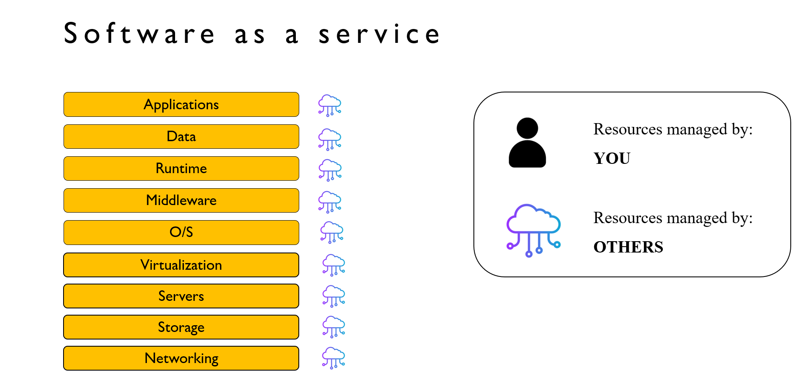
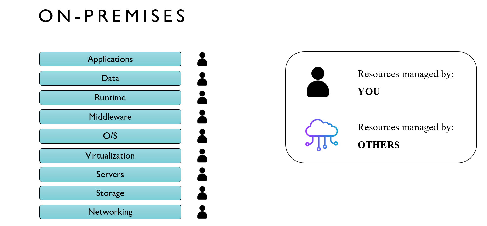

5. [General IT concepts](#5)
6. [Cloud computing - An introduction](#6)
7. [Cloud deployment models](#7)
8. [The types of cloud computing](#8)

---

 

## 5. General IT concepts

### What is IT?

- IT (Information technology) is the use of computers, storage, networking and other devices to create, store and process data

### What is a server?

- Simply put, a server is a piece of computer hardware or software that provides resources/services to other devices, knows as clients

### Limitations of traditional IT

- scaling depends on your ability to get more data centers to store your servers
- contingency plan for natural disasters
- pay for renting the data center and for server maintenance
- people need to monitor all the servers in-case of an outage
- need to have air cooling systems

## 6. Cloud computing - An introduction

### What is cloud computing?

- cloud computing is the on-demand delivery of various computer services: including compute, storage(files), databases, and networking
- perform cloud computing through a cloud service provider: i.e AWS, Azure, Google cloud platform
- you can access as many computing resources as you need, almost instantaneously
- offers a pay-as-you-go pricing model(on demand)
- You can provision which computing resources you require, with any size or type

### The main cloud computing services

- compute
- storage
- database
- networking

### Compute

### Storage

- NOTE: the best way to think storage is see **file**: PNG, JPG, MP4, MP3, excel,

### Storage

- A database is an organized collection of data that is accessed and stored electronically
- we store structured data (data arranged in rows and columns) in a database
- Typical examples includes:
  - PostgreSQL
  - MySQL
  - Oracle

### Networking

#### cloud service providers

- AWS
- Google cloud platform
- Microsoft azure

### Benefits of cloud computing

- Your infrastructure can be made global in a matter of minutes
- Reduced focus on maintaining data centers
- get an accurate idea of your capacity needs
- swap out fixed expenses for variable expenses
- increase dexterity and speed
- lower pay-as-you-go costs

## 7. Cloud deployment models

- public model
- private model
- hybrid model

### Public cloud deployment model

- a cloud hosing provider that provides cloud resources and services to the public for a fee
- example:
  - amazon web services
  - microsoft azure
  - google cloud platform

### Private cloud deployment model

- a cloud hosting provider that provides cloud resources and services privately for security reasons
- example:
  - red hat (company)
  - rackspace (company)

### Hybrid cloud deployment model

- some servers are kept on- remise while other services are extended to the cloud

## 8. The types of cloud computing

### Infra as a service

- a computing service that offers compute, storage and networking resources on demand
- example:
  - Amazon ec2,
  - google cloud platform, azure, digital ocean

### Platform as a service

- do not need to manage the infrastructure i.e: server, database, file storage systems
- focus on the application code and deployment instead
- example:

  - [Heroku](https://www.heroku.com/)
  - [render](https://render.com/)
  - [netlify](https://app.netlify.com/)
  - elastic beanstalk (AWS)

### Software as a service

  
-  a readily available product that is run and managed by a cloud service provider
-  no management needs to be handled
- example:
  - gmail
  - zoom
  - netflix

### On- premises

