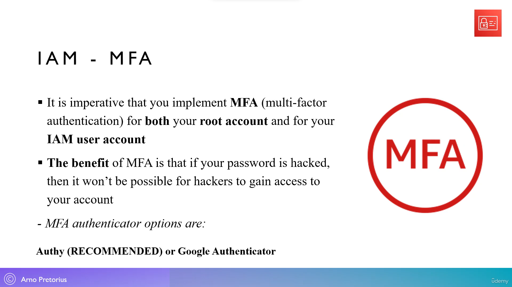
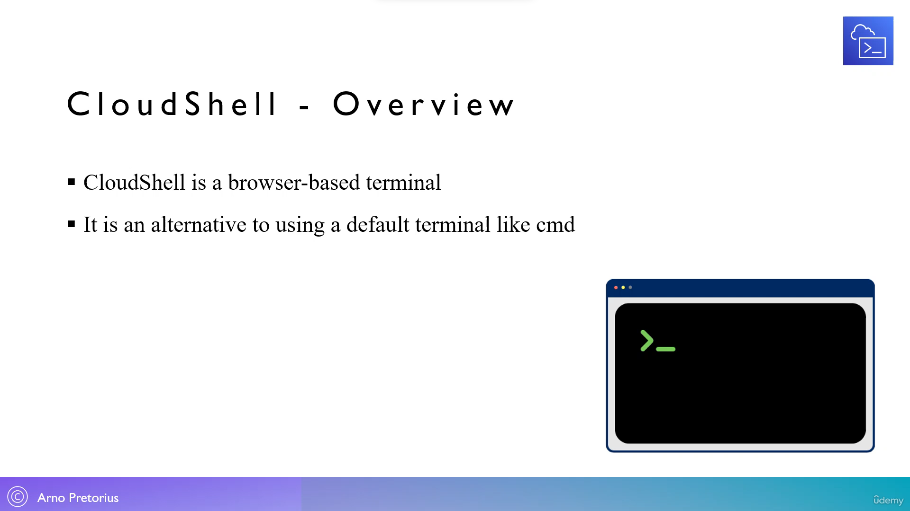

19. [IAM - Overview](#19)
20. [IAM - Create a user and a group - [Lab]](#20)
21. [IAM - Alternate sign-in option](#21)
22. [IAM - Utilise our unique URL - [Lab]](#22)
23. [IAM - Introducing Multi-Factor Authentication - (MFA)](#23)
24. [IAM - Secure your AWS accounts with MFA - [Lab]](#24)
25. [IAM - How can we access AWS?](#25)
26. [IAM - Generate access keys - [Lab]](#26)
27. [IAM - Setup the AWS CLI - [Lab]](#27)
28. [Important note! - AWS CloudShell](#28)
29. [AWS CloudShell - Overview](#29)
30. [Utilizing AWS CloudShell - [Optional]](#30)
31. [IAM - What are password policies?](#31)
32. [IAM - Create a password policy - [Lab]](#32)
33. [IAM - What are security tools?](#33)
34. [IAM - Utilizing security tools - [Lab]](#34)
35. [IAM - What are roles?](#35)
36. [IAM - Create a role - [Lab]](#36)
37. [IAM - Best practices summary](#37)

---

<br>

### 19. IAM - Overview<a id="19"></a>


  

   

  

  


### 20. IAM - Create a user and a group - [Lab]<a id="20"></a>

#### Creating Group

- Go to aws and in auto search type "IAM", bookmark it
- click on left hamburger icon (IAM) under, access management--> user groups --> Create group
- user group name: developer
- attach permissions policy: ✔️adminstratoraccess, ✔️ IAMUserChangePassword
- click on "create group"

#### Creating User

- click on left hamburger icon (IAM) under, access management --> Click on "User"
- User : click on "create user"
- user name: joy
- ✔️ enable : provide user access to the AWS management console:
- Are you providing console access to person --> ✔️ enable : want to create an IAM user
- custom password: secret
- ❌ disable : user must create a new password at next sing-in
- click on next

#### Set permission

- ✔️ enable : add user to group
- ✔️ select : developer
- click on "next" then click on "create user"
- also download .csv file that hold credential

### 21. IAM - Alternate sign-in option<a id="21"></a>


### 22. IAM - Utilise our unique URL - [Lab]<a id="22"></a>

- Go to aws and in auto search type "IAM"
- Scroll "IAM dashboard" till "AWS account", click "create" to create new alias: cloudwithjoy
- copy the url and alias url somewhere

#### How to log in as IAM user

- log out first
- paste the alias url in browser that we saved
-

### 23. IAM - Introducing Multi-Factor Authentication - (MFA)<a id="23"></a>



### 24. IAM - Secure your AWS accounts with MFA - [Lab]<a id="24"></a>

#### MFA for IAM user

- Go to aws and in auto search type "IAM"
- In IAM-dashboard under security recommendation click on "add MFA"
- MFA device name: joyIAMdevice
- MFA device: ✔️ Authenticator app click "next"
- download "google Authenticator app"
- scan qr code using google Authenticator app
- enter code then click

#### MFA for root user

- Go to aws and in auto search type "IAM"
- In IAM-dashboard under security recommendation click on "add MFA"
- MFA device name: joyROOTdevice
- MFA device: ✔️ Authenticator app click "next"
- download "google Authenticator app"
- scan qr code using google Authenticator app
- enter code then click

### 25. IAM - How can we access AWS?<a id="25"></a>


### 26. IAM - Generate access keys - [Lab]<a id="26"></a>

#### create access key for developer

- Go to aws and in auto search type "IAM"
- click on left hamburger icon (IAM) under, access management --> Click on "User"
- select "joy" user and "create access key"
- user case: ✔️ local code--> click next--> create access key
- now copy access key, secret access key to notepad, click done
- click on "security credentials" tab, scroll down till Access key then Actions--> deactivate --> delete

### 27. IAM - Setup the AWS CLI - [Lab]<a id="27"></a>

- Head over to this link [click me](https://docs.aws.amazon.com/cli/latest/userguide/getting-started-install.html)
- scroll down and install 64-bit setup
- open cmd prompt and type cmd

```sh
aws --version
```

### 28. Important note! - AWS CloudShell<a id="28"></a>

### 29. AWS CloudShell - Overview<a id="29"></a>



### 30. Utilizing AWS CloudShell - [Optional]<a id="30"></a>

- Go to aws console home, select region-->mumbai, then open "cloud shell" for that region

```sh
aws --version

# how to list all the users on aws account
aws iam list-users
```

- click on gear icon to increase font in cloud shell

### 31. IAM - What are password policies?<a id="31"></a>


### 32. IAM - Create a password policy - [Lab]<a id="32"></a>

- Go to aws and in auto search type "IAM"
- click on left hamburger icon (IAM) under, access management --> Click on "Account Settings" --> edit
- Password policy --> custom (now edit the rules)

```sh
10 character
expire password in 90 days
✔️ Password expiration require administrator reset
```

### 33. IAM - What are security tools?<a id="33"></a>


### 34. IAM - Utilizing security tools - [Lab]<a id="34"></a>

#### generating credential report

- Go to aws and in auto search type "IAM"
- click on left hamburger icon (IAM) under, access report --> Click on "Credential report" --> Download Credential report

---

#### last service accessed as IAM user

- Go to aws and in auto search type "IAM"
- click on left hamburger icon (IAM) under, access management --> Click on "Users" --> select "joy" user
- scroll down click on "Access Advisor"-tab

### 35. IAM - What are roles?<a id="35"></a>


### 36. IAM - Create a role - [Lab]<a id="36"></a>

- Go to aws and in auto search type "IAM"
- click on left hamburger icon (IAM) under, access management --> Click on "Roles" --> create role
- select trusted type --> ✔️ AWS service
- use case : EC2
- use case : EC2, click next
- permission: ✔️ IAMReadOnlyAccess, click next
- Role name: ReadOnlyRole
- Description: default
- scroll down --> create role

### 37. IAM - Best practices summary<a id="37"></a>


