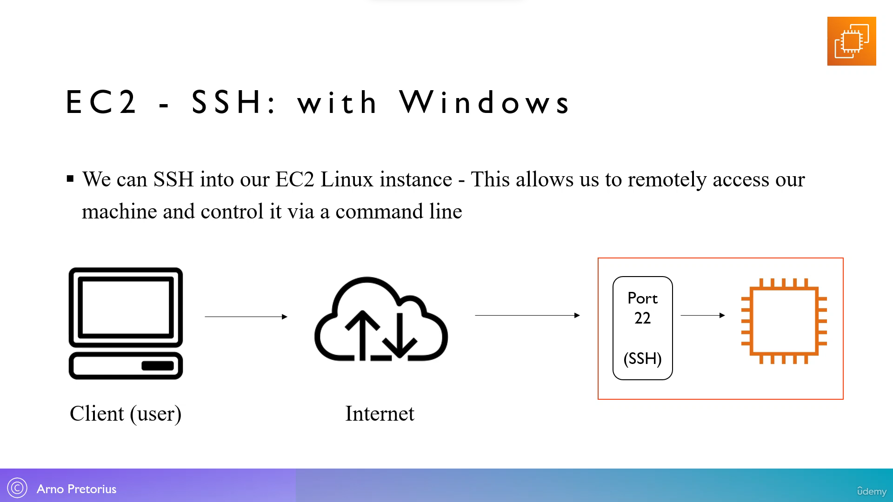

38. [EC2 - Overview](#38)
39. [EC2 - Launching our first EC2 instance - [Lab]](#39)
40. [EC2 - Changing Instance states - [Lab]](#40)
41. [EC2 - Introduction to Security groups](#41)
42. [EC2 - Managing our Security groups - [Lab]](#42)
43. [EC2 - What are the different instance types?](#43)
44. [EC2 - Exploring various instance types - [Lab]](#44)
45. [EC2 - SSH with Windows - [Optional]](#45)
46. [EC2 - Remotely connect to our EC2 Instance - [Optional]](#46)
47. [EC2 - Introduction to Instance connect](#47)
48. [EC2 - Utilize Instance connect - [Lab]](#48)
49. [EC2 - Resource cleanup - [Lab]](#49)
50. [EC2 - Instance pricing options](#50)
51. [EC2 - Instance pricing options - Deep dive - [Lab]](#51)
52. [EC2 - Quick start AMI - [Reminder]](#52)
53. [EC2 - What is an AMI?](#53)
54. [EC2 - Building our own AMI - [Lab]](#54)

---

<br>

### 38. EC2 - Overview<a id="38"></a>


### 39. EC2 - Launching our first EC2 instance - [Lab]<a id="39"></a>

- Go to aws console, in auto search type "EC2" open it
- click on instance(running) --> Launch instance

#### Launch instance

- name and tags: MyEC2Instance

#### Application and OS image (Amazon Machine Image)

- Quick start: Amazon Linux
- default: Amazon Linux 2023 AMI (free tier eligible)

#### Instance type

- instance type: t2.micro (free tier eligible)

#### key pair (login)

- click on "create new key pair"
- key pair name: secret
- key pair type: RSA
- private key file format: .ppk (for windows)
- click "create key pair" to download file

#### Network settings

- Firewall (security group): Create security group
- ✔️ Allow SSH traffic from "anywhere"
- ✔️ Allow HTTP traffic from the internet

#### Configure storage

- 8 GB gp3

#### Advance details

- User data: paste below code (HTML markup)

```sh
#!/bin/bash
# User data code
# Proceed to install httpd - (Amazon Linux 2 version)
yum update -y
yum install -y httpd
systemctl start httpd
systemctl enable httpd
echo "<h1> Hello from Mars!!! from $(hostname -f)</h1>" > /var/www/html/index.html
```

#### Summary

- click on "Launch Instance" --> "view all instance"

#### Instances

- select running instance, copy public-IPv4 paste to browser url

### 40. EC2 - Changing Instance states - [Lab]<a id="40"></a>

- Go to EC2 instance --> running instance --> select any instance
- instance state: stop instance
- instance state: start instance
- instance state: terminate instance

NOTE: whenever we stop and start the instance, public-IPv4 address change and assigned new address.

### 41. EC2 - Introduction to Security groups<a id="41"></a>


### 42. EC2 - Managing our Security groups - [Lab]<a id="42"></a>

- Go to aws console --> EC2 --> running instance --> select instance --> click on Security-tab
- In left side click hamburger icon --> "Network & Security"-dropdown --> Security Groups --> select any

#### Inbound rules

- click on "Edit inbound rule" --> add rule
- type: HTTP
- Anywhere: 0.0.0.0/0
- save

#### Outbound rules

- click on "Edit outbound rule"
-

### 43. EC2 - What are the different instance types?<a id="43"></a>


### 44. EC2 - Exploring various instance types - [Lab]<a id="44"></a>

- Aws instance type [click me](https://aws.amazon.com/ec2/instance-types/?gclid=CjwKCAjw7-SvBhB6EiwAwYdCAdBARHIsgEH3VUZq-EOaSqtyvkpjk4wBUfCqVtav6IJ3176USCmUghoCyIsQAvD_BwE&trk=32f4fbd0-ffda-4695-a60c-8857fab7d0dd&sc_channel=ps&ef_id=CjwKCAjw7-SvBhB6EiwAwYdCAdBARHIsgEH3VUZq-EOaSqtyvkpjk4wBUfCqVtav6IJ3176USCmUghoCyIsQAvD_BwE:G:s&s_kwcid=AL!4422!3!536392685920!e!!g!!aws%20instance%20types!11539707735!118057054048)

### 45. EC2 - SSH with Windows - [Optional]<a id="45"></a>



### 46. EC2 - Remotely connect to our EC2 Instance - [Optional]<a id="46"></a>

- download putty and install
- Go to aws console --> EC2 --> running instance --> select instance, copy public-ipv4
- open putty

#### putty

- host name : paste ip address here
- port : 22
- ✔️ SSH

##### Under Credential-dropdown

- SSH --> Auth --> Browse: private key

#### putty

- saved session: MyEC2Instance --> save
- select the saved "MyEC2Instance" --> load

### 47. EC2 - Introduction to Instance connect<a id="47"></a>


### 48. EC2 - Utilize Instance connect - [Lab]<a id="48"></a>

- Go to aws console --> EC2 --> running instance --> select instance
- Action: Connect
- click on "Connect"

```sh
whoami

clear
```

### 49. EC2 - Resource cleanup - [Lab]<a id="49"></a>

- Go to aws console --> EC2 --> running instance --> select instance
- instance state: stop instance
- instance state: terminate instance

### 50. EC2 - Instance pricing options<a id="50"></a>


### 51. EC2 - Instance pricing options - Deep dive - [Lab]<a id="51"></a>

[Pricing option](https://docs.aws.amazon.com/AWSEC2/latest/UserGuide/instance-purchasing-options.html)

### 52. EC2 - Quick start AMI - [Reminder]<a id="52"></a>

### 53. EC2 - What is an AMI?<a id="53"></a>


### 54. EC2 - Building our own AMI - [Lab]<a id="54"></a>

- Go to aws console --> EC2 --> launch instance

#### Name and tag

- name and tags: TestServer

#### Application and OS image (Amazon Machine Image)

- Quick start: Amazon Linux
- default: Amazon Linux 2023 AMI (free tier eligible)

#### Instance type

- instance type: t2.micro (free tier eligible)

#### key pair (login)

- click on "create new key pair"
- key pair name: secret
- key pair type: RSA
- private key file format: .ppk (for windows)
- click "create key pair" to download file

#### Network settings

- Firewall (security group): Create security group
- ✔️ Select existing security group
- common security group: launch wizard 1

#### Configure storage

- 8 GB gp3

#### Advance details

- User data: paste below code (HTML markup)

```sh
#!/bin/bash
# User data code
# Proceed to install httpd - (Amazon Linux 2 version)
yum update -y
yum install -y httpd
systemctl start httpd
systemctl enable httpd
```

#### Summary

- click on "Launch Instance" --> "view all instance"

#### Instances

- select running instance, copy public-IPv4 paste to browser url

---

#### How to make AMI

- Action --> image and templates --> create image

#### create image

- image name: MyFirstCustomAMI
- everything will be default click on "Create Image"

#### Instances

- click on left hamburger icon, under Images-dropdown
- click on "AMI" to see our own image

#### How to create our own AMI using custom image

- Go to aws console --> EC2 --> launch instance

#### Name and tag

- name and tags: TestMyAMIServer

#### Application and OS image (Amazon Machine Image)

- My AMI: Owned by me
- default: MyFirstCustomAMI

#### Instance type

- instance type: t2.micro (free tier eligible)

#### key pair (login)

- click on "create new key pair"
- key pair name: secret
- key pair type: RSA
- private key file format: .ppk (for windows)
- click "create key pair" to download file

#### Network settings

- Firewall (security group): Create security group
- ✔️ Select existing security group
- common security group: launch wizard 1

#### Configure storage

- 8 GB gp3

#### Advance details

- User data: paste below code (HTML markup)

```sh
#!/bin/bash
# User data code
# Proceed to install httpd - (Amazon Linux 2 version)
echo "<h1> Hello from Mars!!! from $(hostname -f)</h1>" > /var/www/html/index.html
```

#### Summary

- click on "Launch Instance" --> "view all instance"

#### Instances

- select running instance, copy public-IPv4 paste to browser url
