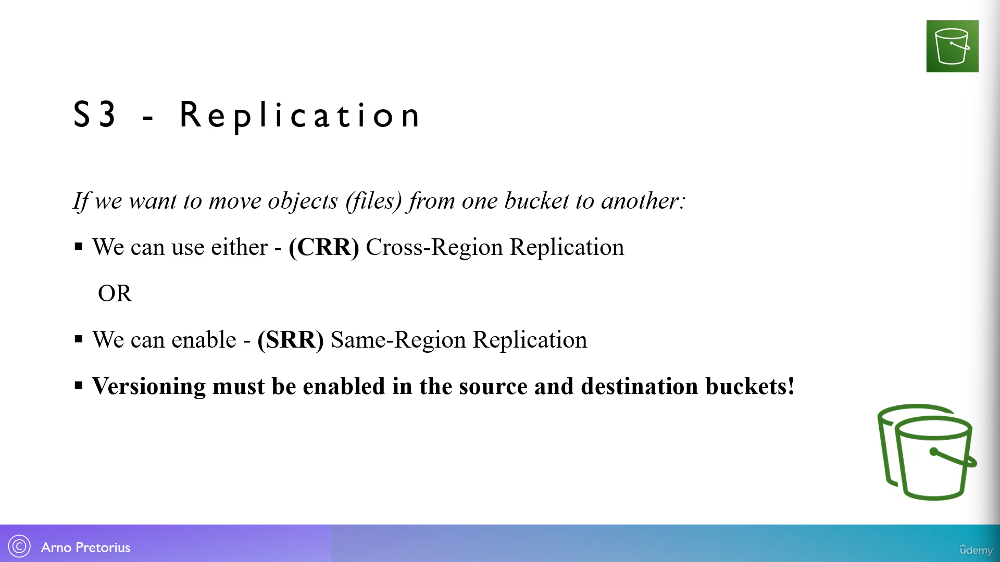
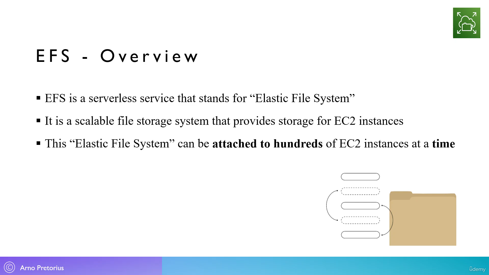

66. [S3 - Overview](#66)
67. [S3 - Working with buckets and objects - [Lab]](#67)
68. [S3 - What is a bucket policy?](#68)
69. [S3 - Create a bucket policy - [Lab]](#69)
70. [S3 - Encryption types](#70)
71. [S3 - Host a static website - [Lab]](#71)
72. [S3 - What is bucket versioning?](#72)
73. [S3 - Enable bucket versioning - [Lab]](#73)
74. [S3 - Introduction to access logging](#74)
75. [S3 - Setup access logging on a bucket - Part 1 - [Lab]](#75)
76. [S3 - What is Replication?](#76)
77. [S3 - Perform Cross-Region-Replication - [Lab]](#77)
78. [S3 - The different types of storage classes](#78)
79. [S3 - Defining object lock](#79)
80. [S3 - Lock an object - [Lab]](#80)
81. [S3 - Setup access logging on a bucket - Part 2 - [Lab]](#81)
82. [S3 - Resource cleanup](#82)
83. [Storage space with EC2?](#83)
84. [EBS - Overview](#84)
85. [EBS - Create an EBS volume - [Lab]](#85)
86. [EBS - Analyzing the snapshot architecture](#86)
87. [EBS - Constructing snapshots - [Lab]](#87)
88. [EFS - Overview](#88)
89. [EC2 Instance store - Overview](#89)

---

### 66. S3 - Overview

### 67. S3 - Working with buckets and objects - [Lab]

- Go to aws dashboard in auto search type "S3" pin it to navigation bar
- S3 --> create bucket

Note:

- a bucket is just a folder
- folder inside bucket as seen as object in amazon

#### General configuration

- Bucket name: dss-demo-bucket
- Aws Region: Mumbai
- Scroll down till bottom, click on "Create bucket"

#### Buckets

- select any bucket by clicking on it

#### How to upload file(object) in bucket : File management operations

- minimize browser horizontal then drag and drop image, index.html file
- Scroll down to the bottom click on "Upload"

##### How to view files : File management operations

- Amazon S3 --> Buckets --> dss-demo-bucket --> click on "cat.jpg" --> open

##### How to delete any object from bucket : File management operations

- Amazon S3 --> Buckets --> dss-demo-bucket --> ☑️ cat.jpg --> Delete --> permanently delete --> Delete object

##### How to download any object from bucket : File management operations

- Amazon S3 --> Buckets --> dss-demo-bucket --> ☑️ index.html --> Download

##### How to view files : File management operations

- Amazon S3 --> Buckets --> dss-demo-bucket --> ☑️ index.html --> Open

##### How to move, edit, copy ... files : File management operations

- Amazon S3 --> Buckets --> dss-demo-bucket --> click on "index.html" --> Object actions

##### How to create folder : File management operations

- Amazon S3 --> Buckets --> dss-demo-bucket --> create folder
- folder name: cats

### 68. S3 - What is a bucket policy?

  

### 69. S3 - Create a bucket policy - [Lab]

- Amazon S3 --> Buckets --> dss-demo-bucket --> Permission-tab

#### Block public access (bucket settings)

- click on "Edit" --> ❌ Block all public access --> Save changes

#### Bucket policy

- click on "Edit" --> Policy generator (open in new tab)

---

#### AWS policy generator

- select type of policy : S3 bucket policy
- Effect: allow
- Principal: \* (everyone)
- Actions: GetObject
- Amazon resource name: go to bucket copy and paste here with forward-slash with star at end '/_' (arn:aws:s3::dss-demo-bucket/_)
- click on "add statement" --> generate policy --> copy all the json code (switch to Bucket policy tab)

---

#### Bucket policy

- Policy: paste all the json code here
- Scroll down --> "Save changes"

- Amazon S3 --> Buckets --> dss-demo-bucket --> index.html --> object URl (open link in new tab)

### 70. S3 - Encryption types

### 71. S3 - Host a static website - [Lab]

- Amazon S3 --> Buckets --> dss-demo-bucket --> Properties-tab
- Scroll down to bottom until you see "Static website hosting"

#### Static website hosting

- click on "Edit"
- Static website hosting: Enable
- Hosting type: Host a static website
- Index document: index.html
- Scroll down --> Save change

- Amazon S3 --> Buckets --> dss-demo-bucket
- Scroll down till "Static website hosting" --> open link in new point

### 72. S3 - What is bucket versioning?

### 73. S3 - Enable bucket versioning - [Lab]

Option 1: When creating new bucket

- Amazon S3 --> Buckets --> Create Bucket

#### General configuration

- Bucket name: dss-demo-bucket
- Aws Region: Mumbai
- Scroll down till bottom, click on "Create bucket"

#### Bucket versioning

- Bucket versioning: ✔️ enable

---

Option 2: After creating new bucket

- Amazon S3 --> Buckets --> dss-demo-bucket --> properties-tab --> Bucket versioning --> edit
- Bucket versioning: ✔️ enable
- Scroll down --> "Save changes"

---

- Amazon S3 --> Buckets --> dss-demo-bucket --> show version(option)
- edit the same index.html file on desktop, that we upload on bucket
- shrink the browser window, drag and drop index.html file to upload --> Upload
- Amazon S3 --> Buckets --> dss-demo-bucket --> index.html --> open
- to rollback to earlier file just delete the new index.html file by selecting --> delete

### 74. S3 - Introduction to access logging

### 75. S3 - Setup access logging on a bucket - Part 1 - [Lab]

- Amazon S3 --> Buckets --> Create bucket

- Bucket name: dss-logging-bucket
- Aws Region: Mumbai
- Scroll down till bottom, click on "Create bucket"

---

- Amazon S3 --> Buckets --> dss-demo-bucket --> properties-tab

#### Server access logging

- Edit
- Server access logging: ✔️ Enable
- Target bucket: browse (select dss-logging-bucket)
- click on "Choose path" ---> Save changes

---

- Amazon S3 --> Buckets --> dss-demo-bucket --> Objects-tab --> ☑️index.html --> open
- open files, delete some file, upload files, to generate log request
- Amazon S3 --> --> dss-logging-bucket (it takes 24-hrs to generate log request files )

### 76. S3 - What is Replication?

### 77. S3 - Perform Cross-Region-Replication - [Lab]

- Create two new bucket
- Amazon S3 --> Buckets --> Create bucket
- Bucket name: s3-joy-source
- Aws Region: Mumbai

#### Bucket versioning

- Bucket versioning: enable
- Scroll down till bottom, click on "Create bucket"

---

- Amazon S3 --> Buckets --> Create bucket
- Bucket name: s3-joy-destination
- Aws Region: EU (London) eu-west-2

#### Bucket versioning

- Bucket versioning: enable
- Scroll down till bottom, click on "Create bucket"

---

- Amazon S3 --> Buckets --> s3-joy-source -->Management-tab --> Replication rules --> create replication rule

#### Replication rule configuration

- Replication rule name: ReplicationRule 1
- Status: enabled

#### Source bucket

- choose a rule scope: Apply to all objects in the bucket

#### Destination

- Destination: Choose a bucket in this account
- Bucket name: Browse S3(s3-joy-destination) --> Choose path

#### IAM role

- ✔️ Choose from existing IAM roles
- IAM role: Create new role
- Scroll down till bottom --> Save

#### Replicate existing objects? -Pop-up dialog

- Existing objects: No, do not replicate existing objects --> Submit

---

- Amazon S3 --> Buckets --> s3-joy-source --> object-tab
- Shrink the browser window, drag and drop files from desktop to upload --> Upload

- Amazon S3 --> Buckets --> s3-joy-Destination --> object-tab
- now we can see here automatically files are added here

### 78. S3 - The different types of storage classes

### 79. S3 - Defining object lock

### 80. S3 - Lock an object - [Lab]

- Amazon S3 --> Buckets --> Create bucket
- Bucket name: dss-lock-object
- Aws Region: mumbai

#### Bucket versioning

- Bucket versioning: enable

#### Advanced Settings

- Object Lock: enable
- ✔️ I acknowledge that enabling Object Lock ...
- Scroll down till bottom, click on "Create bucket"

---

- Amazon S3 --> Buckets --> dss-lock-object --> Object-tab
- Upload --> Add file --> cat1.jpg --> Upload

---

- Amazon S3 --> Buckets --> dss-lock-object --> Object-tab --> cat1.jpg --> Properties-tab

#### Object Lock retention

- Edit
- Retention: Enable
- Retention mode: Governance mode
- Retain until date: select any day, for instance 1 day
- Scroll down till bottom, click on "Save Changes"

### 81. S3 - Setup access logging on a bucket - Part 2 - [Lab]

- log files generated after 24 hours in log-bucket

### 82. S3 - Resource cleanup

#### How to Delete all object inside bucket

- Amazon S3 --> Buckets --> ✅ dss-demo-bucket --> Empty --> permanently delete --> Empty

#### How to Delete bucket

- Amazon S3 --> Buckets --> ✅ dss-demo-bucket --> Delete --> dss-demo-bucket --> Delete bucket

Repeat process for all bucket

### 83. Storage space with EC2?

### 84. EBS - Overview

### 85. EBS - Create an EBS volume - [Lab]

- Go to aws console, in auto search type "EC2" open it
- click on instance(running) --> Launch instance

#### Launch instance

- name and tags: MyEC2Server

#### Application and OS image (Amazon Machine Image)

- Quick start: Amazon Linux
- default: Amazon Linux 2023 AMI (free tier eligible)

#### Instance type

- instance type: t2.micro (free tier eligible)

#### key pair (login)

- click on "create new key pair"
- key pair name: secret
- key pair type: RSA
- private key file format: .ppk (for windows)
- click "create key pair" to download file

#### Network settings

- Firewall (security group): Create security group
- ✔️ Allow SSH traffic from "anywhere"
- ✔️ Allow HTTP traffic from the internet

#### Configure storage

- 8 GB gp3

#### Summary

- click on "Launch Instance" --> "view all instance"

#### Instances

- select running instance, copy public-IPv4 paste to browser url

---

- Go to EC2 dashboard --> Elastic Block Store-side-bar --> Volumes --> Create Volume

#### Volume Settings

- Volume type: General purpose SSD (gp2)
- Size(GiB): 2
- Availability Zone: us-east-2b (this must be same as EC2 instance Availability Zone)
- Scroll down till bottom --> Create Volume

---

#### How to attach EBS Volume to EC2 instance

- Go to EC2 dashboard --> Elastic Block Store-side-bar --> Volumes
- ✅ select EBS volume --> Actions --> Attach volume

#### Basic details

- Instance: MyEC2Server --> Attach Volume

---

#### Auto deletion of EBS Volume attach to MyEC2Instance

- Go to EC2 dashboard --> Elastic Block Store-side-bar --> Volumes
- ✅ select root EBS volume
- ❌ deselect newly created EBS volume
- EC2 dashboard --> Instances --> ✅ select "MyEC2Server" --> Instance state --> Terminate
- Go to EC2 dashboard --> Elastic Block Store-side-bar --> Volumes (to check root volume has been deleted)

### 86. EBS - Analyzing the snapshot architecture

### 87. EBS - Constructing snapshots - [Lab]

- Go to AWS Console --> EC2 dashboard

#### Resources

- click on "Volumes"

#### Volumes

- ✅ select EBS volume --> Actions --> Create snapshot

#### Create snapshot

- Description: EBS-Snapshot
- Scroll down --> Create snapshot

---

#### How to create volume from snapshot

- Go to AWS Console --> EC2 dashboard --> Elastic Block Store-sidebar --> Snapshots
- ✅ select Snapshot --> Actions --> Create volume from snapshot

#### Create volume

- Volume type: default
- Size: default
- Availability Zone: us-east-2a (region not changeable)
- Scroll down --> Create Volume

---

#### How to copy

- Go to AWS Console --> EC2 dashboard --> Elastic Block Store-sidebar --> Snapshots
- ✅ select Snapshot --> Actions --> Copy snapshot

#### Settings

- Description: default
- Destination Region: us-east-2 (region changeable: good for disaster recovery)
- Scroll down --> Copy snapshot

---

Cleanup process

#### How to delete snapshot

- Go to AWS Console --> EC2 dashboard --> Elastic Block Store-sidebar --> Snapshots
- ✅ select Snapshot --> Actions --> Delete snapshot

#### How to delete volume

- Go to AWS Console --> EC2 dashboard --> Elastic Block Store-sidebar --> Volume
- ✅ select Snapshot --> Actions --> Delete Volume

### 88. EFS - Overview

### 89. EC2 Instance store - Overview

