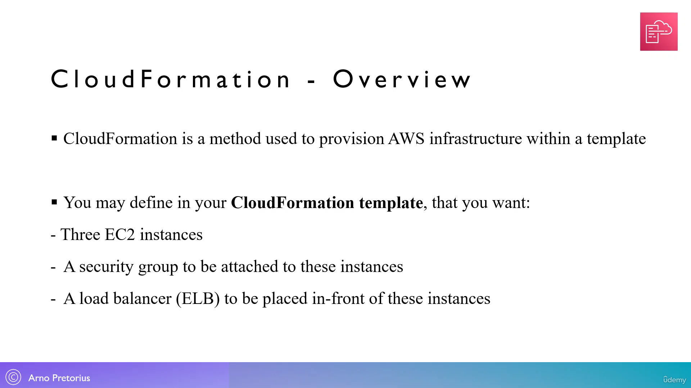
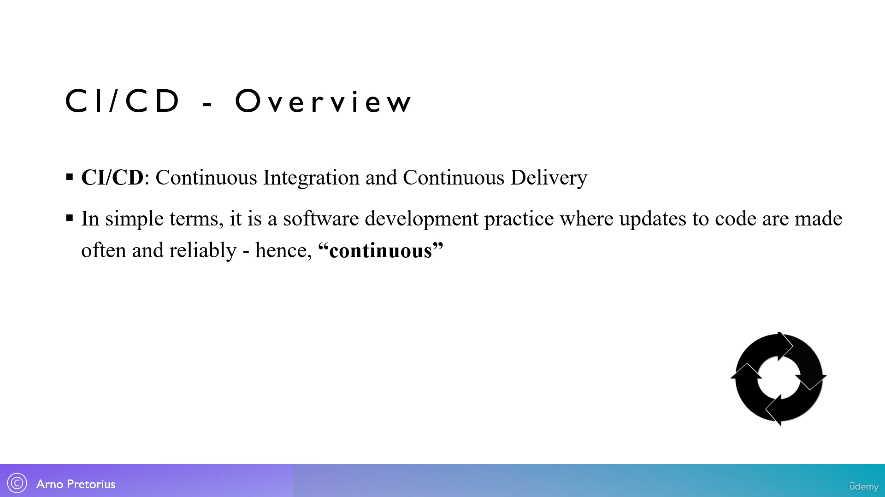
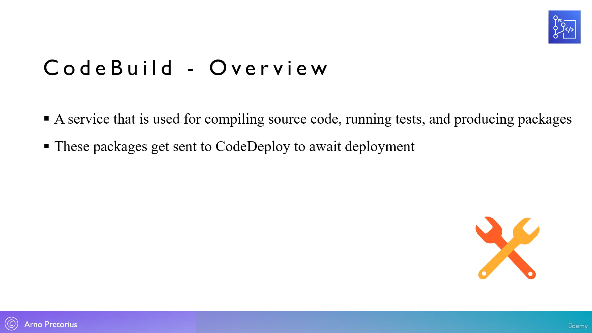

99. [CloudFormation - Overview](#99)
100. [Create a stack with CloudFormation - [Lab]](#100)
101. [Update a stack with CloudFormation - [Lab]](#101)
102. [Delete a stack with CloudFormation - [Lab]](#102)
103. [Elastic Beanstalk - Overview](#103)
104. [Create a sample app with Elastic Beanstalk - [Lab]](#104)
105. [CI/CD - An introduction](#105)
106. [AWS CodeCommit - Overview](#106)
107. [AWS CodeBuild - Overview](#107)
108. [AWS CodeDeploy - Overview](#108)
109. [AWS CodePipeline - Overview](#109)
110. [AWS CodeStar - Overview](#110)
111. [Create an AWS CodeStar project - Part 1 - [Lab]](#111)
112. [Create an AWS CodeStar project - Part 2 - [Lab]](#112)
113. [AWS CodeArtificat - Overview](#113)
114. [Cloud9 IDE - Overview](#114)
115. [Utilize the Cloud9 IDE - [Lab]](#115)

---

<br>

### 9. CloudFormation - Overview<a id="99"></a>

- Cloud Formation is a part of Iaac: Infrastructure as a code
- we create our infrastructure from source code in yml/json, instead of aws management console



### 100. Create a stack with CloudFormation - [Lab]<a id="100"></a>

- Go to AWS console, In Auto Search type "cf" i.e cloud formation and pin it to navigation bar
- click on "cloud formation"
- set region : mumbai
- click on "Create stack"

#### Prerequisite -Prepare template

- Prepare template: Template is ready

#### Specify template

- Template source: Upload a template file
- Choose file: look inside "12 deployment of AWS" folder
- Scroll down --> Next

#### Stack name

- Stack name: MyFirstStack
- Scroll down --> Next

#### Stack failure options

- ✅ Roll back all stack resources
- Scroll down --> Next

#### Review MyFirstStack

- Scroll down --> Submit

### 101. Update a stack with CloudFormation - [Lab]<a id="101"></a>

- CloudFormation --> stack --> MyFirst Stack --> update

#### Prerequisite -Prepare template

- Prepare template: Replace current template

#### Specify template

- Template source: Upload a template file
- Choose file: look inside "12 deployment of AWS" folder
- Edit the AvailabilityZone: us-east-1a to AvailabilityZone: us-east-1c using VS-code editor

```yml
---
Resources:
  MyEC2Instance:
    Type: AWS::EC2::Instance
    Properties:
      AvailabilityZone: us-east-1c
      ImageId: ami-a4c7edb2
      InstanceType: t2.micro
```

- Scroll down --> Next

#### Stack name

- Stack name: MyFirstStack
- Scroll down --> Next

#### Stack failure options

- ✅ Roll back all stack resources
- Scroll down --> Next

#### Review MyFirstStack

- Scroll down --> Submit

### 102. Delete a stack with CloudFormation - [Lab]<a id="102"></a>

- CloudFormation --> stack --> MyFirst Stack --> delete

### 103. Elastic Beanstalk - Overview<a id="103"></a>

PaaS, same service offers by heroku


### 104. Create a sample app with Elastic Beanstalk - [Lab]<a id="104"></a>

- Go to aws console, In auto search type "eb" i.e elastic beanstalk, pin it to navigation bar
- click on "elastic beanstalk"
- click on "Create application"

#### Environment tier

- ✅ Web server environment

#### Application information

- Applicatio name: MyApplication

#### Platform

- Platform: Node.js
- platform branch: default
- Platform version: default

#### Application code

- ✅ sample application

#### Configuration presets

- ✅ Single instance (free tier eligible)
- scroll down --> Next

#### Service role

- ✅ Create and use new service role

---

- open "IAM" in new tab from nav-bar
- Scroll down till "Roles" --> Create role
- Trusted entity type: AWS service
- Common use cases: ✅ EC2
- Scroll down --> Next

#### permission policies

- search: elasticbeanstalk
- add policy: ✅AWSWElasticBeanstalkWebTier, ✅AWSElasticBeanStalkWorkerTIer. ✅AWSElasticBeanStalkMulticontainerDocker
- scroll down --> Next

#### Roles

- role name: Elastic-Beanstalk-Role
- scroll down --> Create role

---

- Continue... get back to Elastic Beanstalk
- EC2 key pair:
- EC2 instance profile: Elastic-Beanstalk-Role
- scroll down --> Skip to review
- scroll down --> Submit

- Go to Elastic Beanstalk --> Environments --> MyApplication-env
- Open application in new tab by clicking below "Domain" link: MyApplication-env.eba...

#### How to terminate Elastic beanstalk

- Go to Elastic Beanstalk --> Environments --> MyApplication-env
- Actions --> Terminate environment

- Go to Elastic Beanstalk --> Applications --> ✅ My Application
- Actions --> Delete Application

- Go to EC2 dashboard and check ec2 instance is deleted

### 105. CI/CD - An introduction<a id="105"></a>



### 106. AWS CodeCommit - Overview<a id="106"></a>


### 107. AWS CodeBuild - Overview<a id="107"></a>



### 108. AWS CodeDeploy - Overview<a id="108"></a>


### 109. AWS CodePipeline - Overview<a id="109"></a>


### 110. AWS CodeStar - Overview<a id="110"></a>


### 111. Create an AWS CodeStar project - Part 1 - [Lab]<a id="111"></a>

- Go to AWS console, In auto search type "COdeCommit" pit it to navigation bar
- click on codeCOmmit
- click on "Create repository"

#### Repository settings

- repository name: My-AWS-REPO
- Description: My-AWS-REPO
- Scroll down --> Next

#### How to Delete Repository

- Developer Tools --> CodeCommit --> Repositories --> ✅ My-AWS-REPO --> Delete repository

####

### 112. Create an AWS CodeStar project - Part 2 - [Lab]<a id="112"></a>

### 113. AWS CodeArtificat - Overview<a id="113"></a>

### 114. Cloud9 IDE - Overview<a id="114"></a>

### 115. Utilize the Cloud9 IDE - [Lab]<a id="115"></a>
