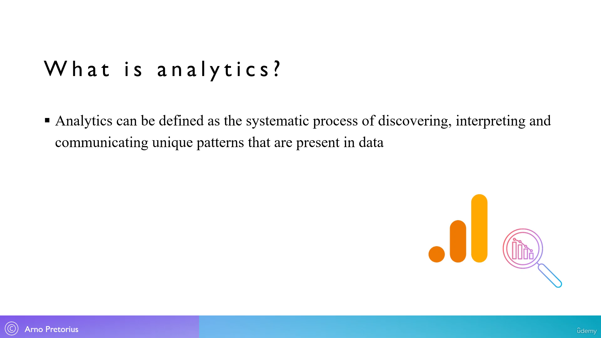
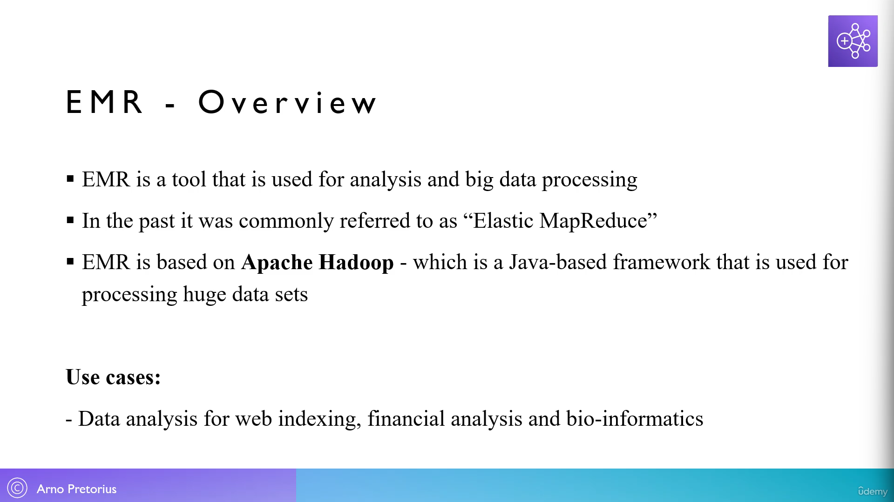
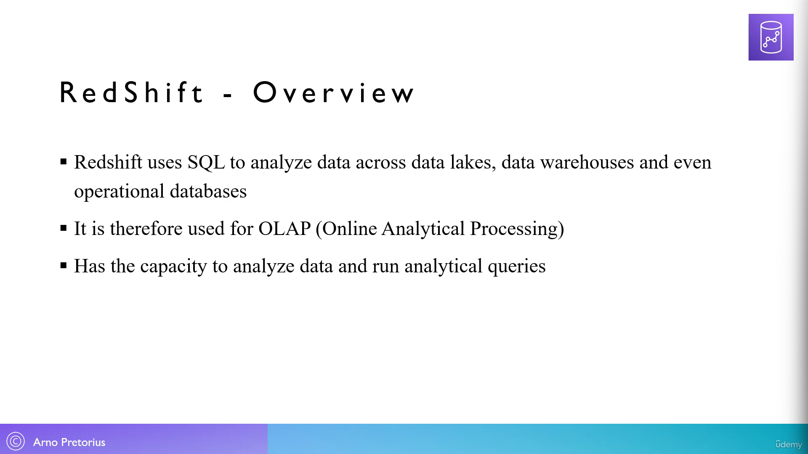
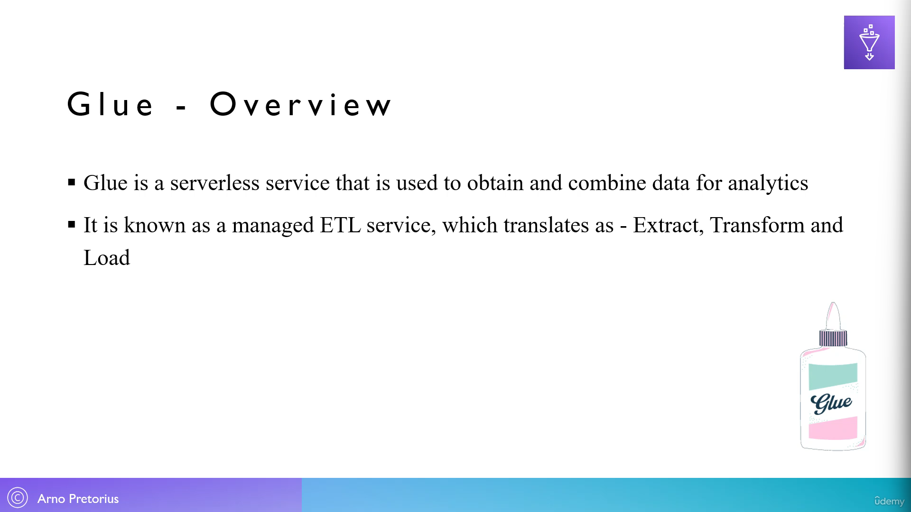

154. [What is analytics - Overview](#154)
155. [Amazon Athena - Overview](#155)
156. [Amazon EMR - Overview](#156)
157. [Amazon QuickSight - Overview](#157)
158. [Amazon RedShift - Overview](#158)
159. [AWS Glue - Overview](#159)
160. [AWS Lake Formation - Overview](#160)
161. [AWS Data Exchange - Overview](#161)

---

 

### 154. What is analytics - Overview

### 155. Amazon Athena - Overview

### 156. Amazon EMR - Overview

### 157. Amazon QuickSight - Overview

### 158. Amazon RedShift - Overview

### 159. AWS Glue - Overview

### 160. AWS Lake Formation - Overview

### 161. AWS Data Exchange - Overview

